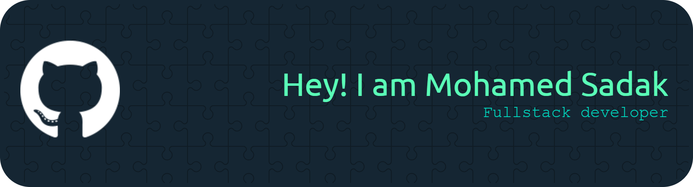

<h3 align="center">
  Crafting elegant solutions with code 💻 
  Building modern, robust web applications 🚀
</h3>

  

 

### 🚀 About Me

<table width="100%">
  <tr>
    <td width="55%">
<pre lang="javascript">
const mohamed = {
  location: "Agadir, Morocco MA",
  role: "Full Stack Developer",
  currentFocus: ["React", "Laravel", "DevOps"],
  expertise: "UI/UX & System Architecture",
  workingOn: ["EauConnect", "LMS Platform"],
  philosophy: "First, solve the problem. Then, write the code.",
  lifeGoal: "Building complete web apps from modern UI to robust backend"
};
</pre>
    </td>
    <td width="45%" align="center">
      
    </td>
  </tr>
</table>

---

### 💼 What I'm Up To

🌱 **Currently Learning:** DevOps technologies, Node.js & PostgreSQL
💬 **Ask Me About:** React, Laravel, and Full Stack architectures
📫 **Reach Me:** mohamedsadak.pro@gmail.com
⚡ **Current Vibe:** Code, Deploy, Learn, Repeat 🔄
🎯 **Goals:** Master DevOps & launch impactful web applications

 

  <h2>🛠️ Tech Arsenal</h2>
  

  <h3>💻 Languages</h3>
  
  
  

  <h3>🎨 Frontend</h3>
  
  

  <h3>⚙️ Backend</h3>
  
  

  <h3>🗄️ Database</h3>
  
  

  <h3>🔧 Tools & Platforms</h3>
  
  
  

 

  <h2>📊 GitHub Analytics</h2>
  

  
  

 

  

 

  <h2>🐍 Contribution Graph</h2>
  
  <picture>
    <source media="(prefers-color-scheme: dark)" srcset="https://raw.githubusercontent.com/mohamed-sadak/mohamed-sadak/output/github-contribution-grid-snake-dark.svg">
    <source media="(prefers-color-scheme: light)" srcset="https://raw.githubusercontent.com/mohamed-sadak/mohamed-sadak/output/github-contribution-grid-snake.svg">
    
  </picture>

 

  <h2>🏆 GitHub Trophies</h2>
  
  

 

  <h2>🤝 Let's Connect</h2>
  
   
  
  

 

  <blockquote>
    
<i>"Talk is cheap. Show me the code."</i> – Linus Torvalds

  </blockquote>

 

  
  
✨ Crafted with 💙 and lots of ☕ by <b>Mohamed Sadak</b>

